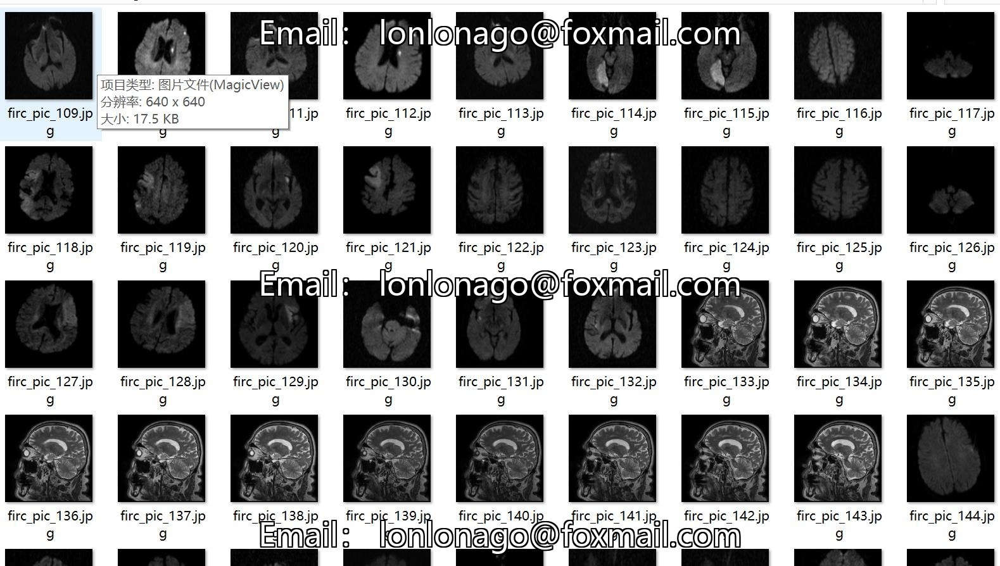
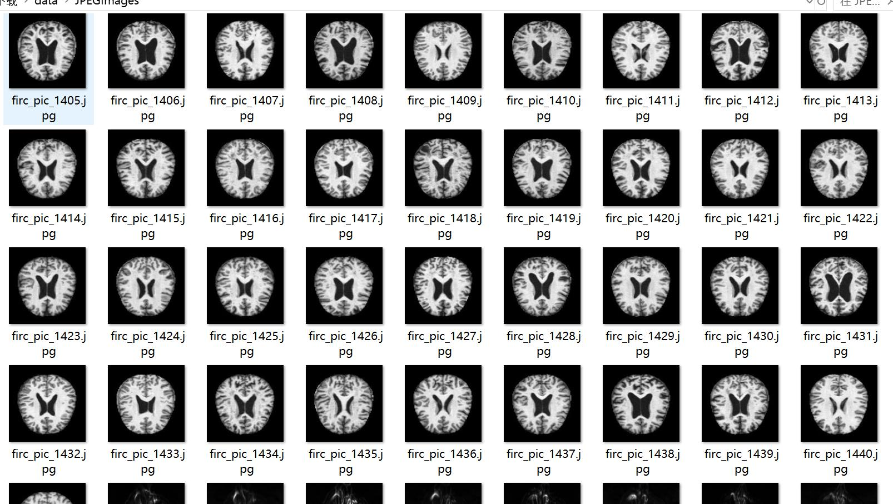
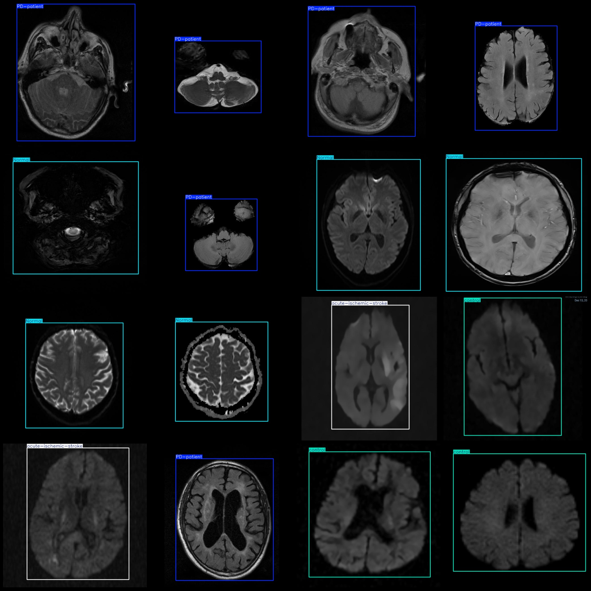
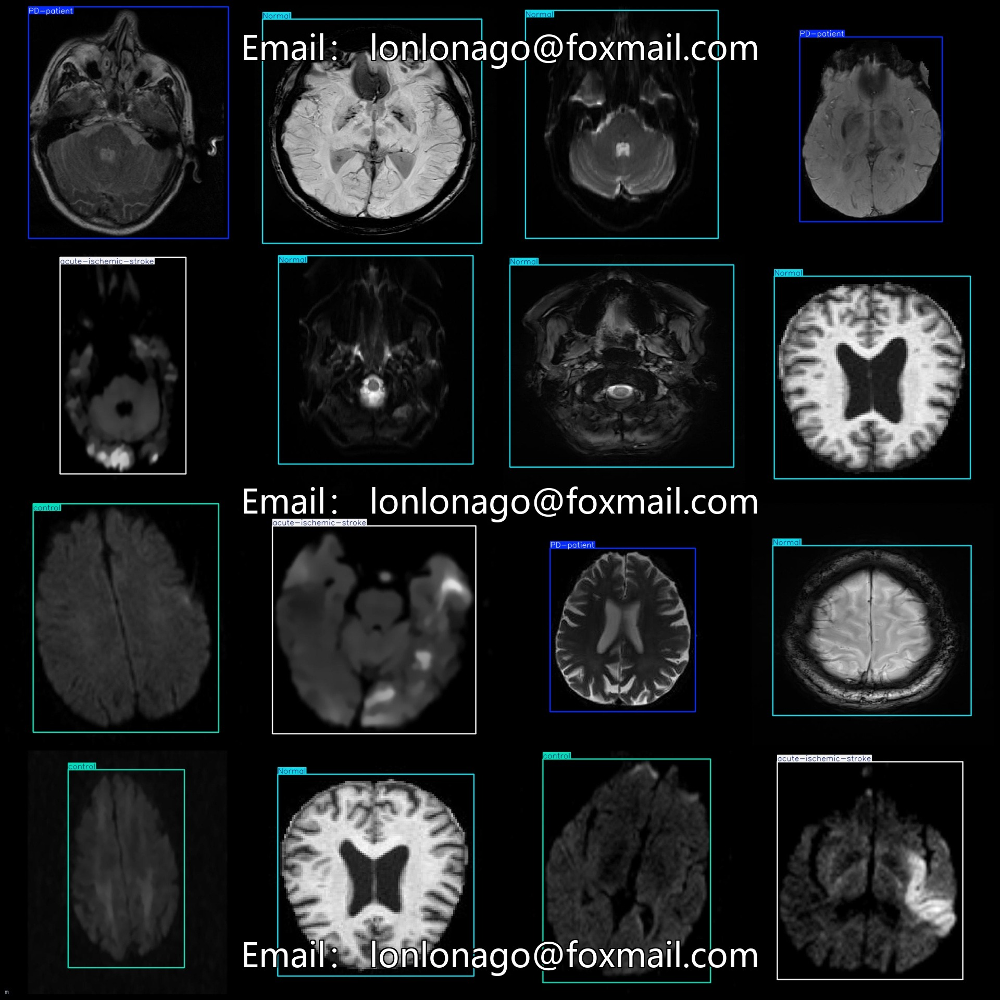

# Smart Medical Brain MRI for Parkinson's Disease and Acute Ischemic Stroke Detection Dataset (VOC+YOLO format) - 1596 images in 4 categories

Please note that more than half of the images are enhanced. For details, please refer to the image preview.
The dataset format is Pascal VOC format plus YOLO format (excluding the segmentation path in the txt file, only including jpg images and their corresponding VOC format xml files and YOLO format txt 
files).
Number of images (jpg file count): 1596
Number of annotations (xml file count): 1596
Number of annotations (txt file count): 1596
Number of annotation categories: 4
Annotation category names (note that the order of categories in the YOLO format does not correspond to this, but rather based on the labels folder "classes.txt"): ["Normal", "PD-patient", 
"acute-ischemic-stroke", "control"]
Box counts per category:
"Normal" (normal) boxes = 398
"PD-patient" (Parkinson's disease patient) boxes = 398
"acute-ischemic-stroke" (acute ischemic stroke) boxes = 404
"control" (control) boxes = 398
Total boxes: 1598
Number of images per category:
"Normal" (normal) images = 398
"PD-patient" (Parkinson's disease patient) images = 396
"acute-ischemic-stroke" (acute ischemic stroke) images = 404
"control" (control) images = 398
Image resolution: 640x640
Annotation tool used: labelImg
Annotation rules: draw boxes around the categories
Important notice: The dataset does not have been divided into training, validation, or test sets; you need to do so yourself.
Special declaration: This dataset does not guarantee any accuracy of the trained models or weight files.
Image preview:

## Images

Here is a pay link on Stripe ( https://buy.stripe.com/3cs8yP7sY87d0vu9AB ). Please contact me lonlonago@foxmail.com after funding $89, and I will send you a complete data files , thank you!

